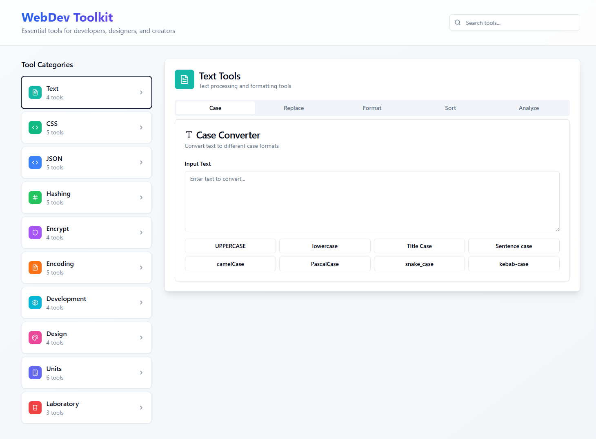

# WebDev Toolkit 🛠️

A comprehensive collection of essential web development tools including JSON formatters, encoders, converters, and utilities for developers and designers.



## 🚀 Features

- **JSON Tools**: Format, validate, and manipulate JSON data
- **Encoding/Decoding**: Base64, URL encoding, and more
- **JWT Decoder**: Inspect JSON Web Tokens
- **URL Shortener**: Generate short URLs
- **Developer Utilities**: Various tools for web development
- **Modern UI**: Clean, responsive interface built with shadcn/ui
- **Dark/Light Mode**: Theme switching support

## 🛠️ Tech Stack

### Frontend Framework
- **React 18** - Modern React with hooks and concurrent features
- **TypeScript** - Type-safe JavaScript development
- **Vite** - Fast build tool and development server

### UI & Styling
- **Tailwind CSS** - Utility-first CSS framework
- **shadcn/ui** - High-quality React components built on Radix UI
- **Radix UI** - Unstyled, accessible UI primitives
- **Lucide React** - Beautiful & consistent icon library
- **next-themes** - Theme switching functionality

### State Management & Forms
- **React Hook Form** - Performant forms with easy validation
- **Zod** - TypeScript-first schema validation
- **@hookform/resolvers** - Form validation resolvers
- **TanStack Query** - Powerful data synchronization

### Additional Libraries
- **React Router DOM** - Client-side routing
- **date-fns** - Modern JavaScript date utility library
- **Recharts** - Composable charting library
- **Embla Carousel** - Lightweight carousel library
- **Sonner** - Toast notifications
- **class-variance-authority** - CSS-in-TS variants API

### Development Tools
- **ESLint** - Code linting and formatting
- **TypeScript ESLint** - TypeScript-specific linting rules
- **Autoprefixer** - CSS vendor prefixing
- **PostCSS** - CSS transformation tool

## 🏃‍♂️ Getting Started

### Prerequisites
- Node.js (v16 or higher)
- npm or yarn package manager

### Installation

1. Clone the repository:
```bash
git clone https://github.com/apsolut/webdev-toolbox.git
cd webdev-toolbox
```

2. Install dependencies:
```bash
npm install
# or
yarn install
```

3. Start the development server:
```bash
npm run dev
# or
yarn dev
```

4. Open your browser and navigate to `http://localhost:5173`

## 📜 Available Scripts

- `npm run dev` - Start development server
- `npm run build` - Build for production
- `npm run build:dev` - Build in development mode
- `npm run preview` - Preview production build
- `npm run lint` - Run ESLint

## 🏗️ Project Structure

```
webdev-toolbox/
├── public/                 # Static assets
├── src/
│   ├── components/        # React components
│   │   ├── ui/           # shadcn/ui components
│   │   └── tools/        # Tool-specific components
│   ├── pages/            # Page components
│   ├── lib/              # Utility functions
│   └── main.tsx          # Application entry point
├── index.html            # HTML template
├── package.json          # Dependencies and scripts
├── tailwind.config.ts    # Tailwind CSS configuration
├── tsconfig.json         # TypeScript configuration
└── vite.config.ts        # Vite configuration
```

## 🎨 UI Components

This project uses [shadcn/ui](https://ui.shadcn.com/) components, which are:
- Built on top of Radix UI primitives
- Fully accessible and keyboard navigable
- Customizable with Tailwind CSS
- Copy-paste friendly (not an npm dependency)

## 🌟 Contributing

Contributions are welcome! Please feel free to submit a Pull Request.

## 📄 License

This project is open source and available under the [MIT License](LICENSE).

## 👨‍💻 Creator

**Aleksandar Perisic**
- GitHub: [@apsolut](https://github.com/apsolut)
- Twitter: [@apsolut](https://twitter.com/apsolut)

---

*Built with ❤️ using React, TypeScript, and modern web technologies.*